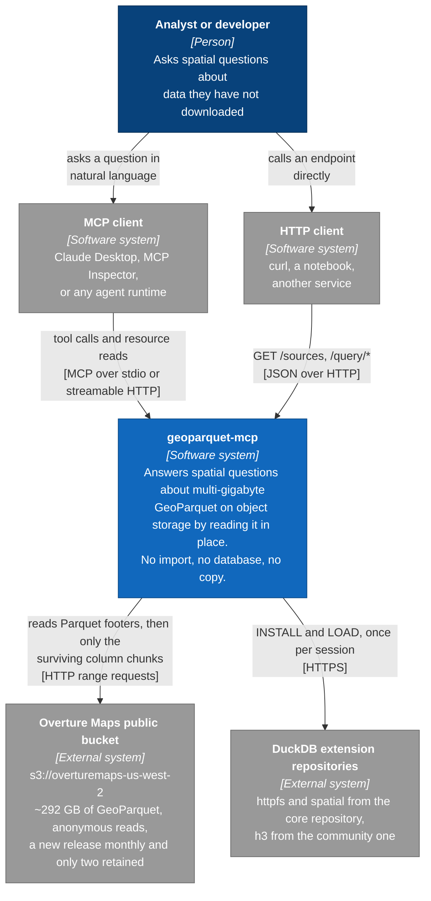
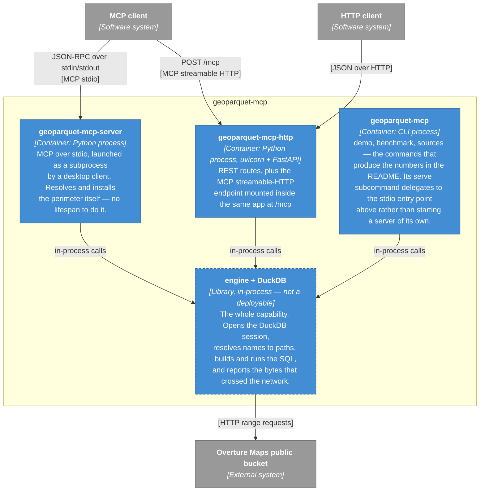
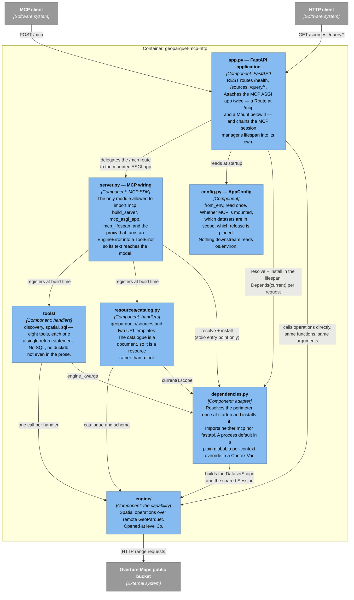
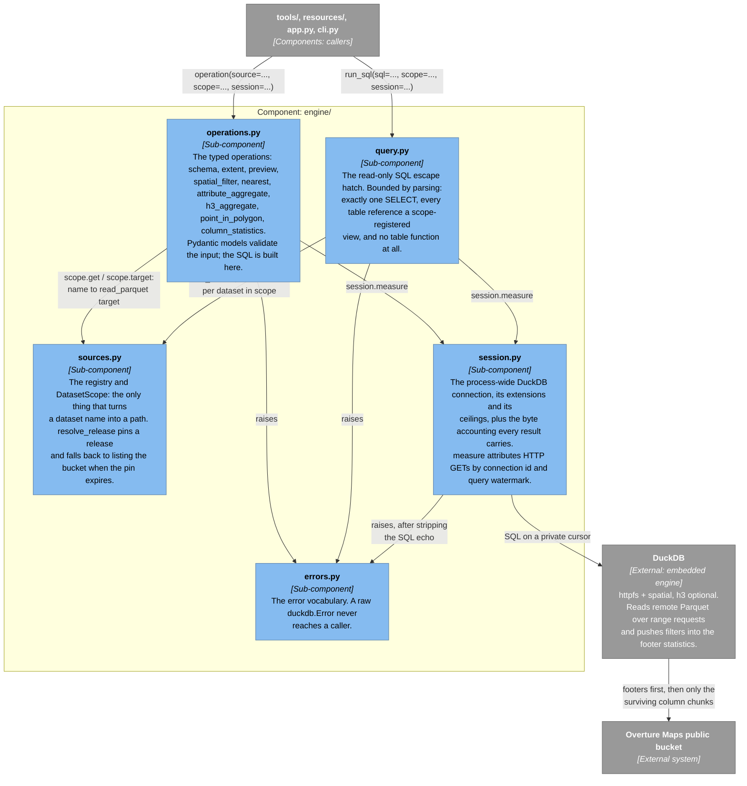
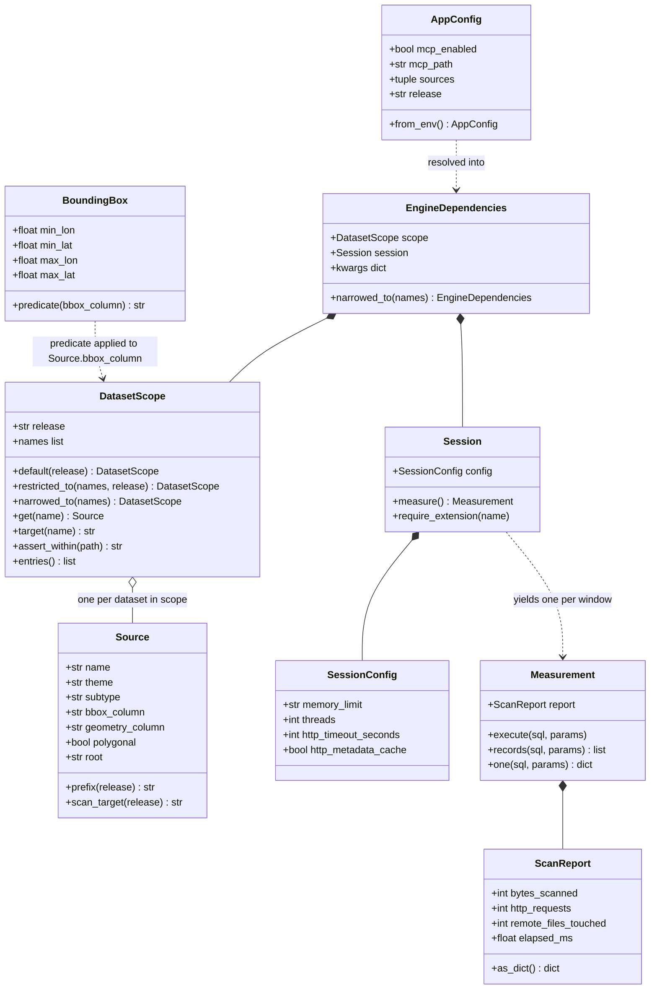
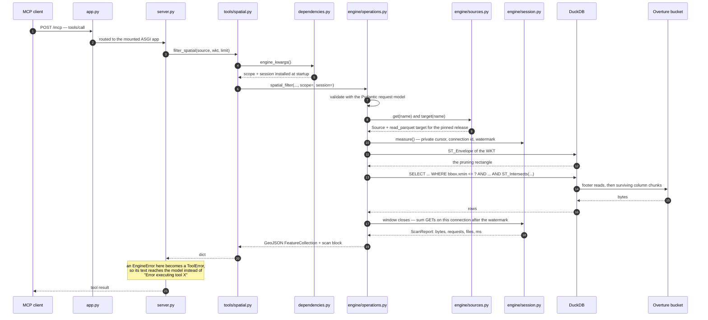
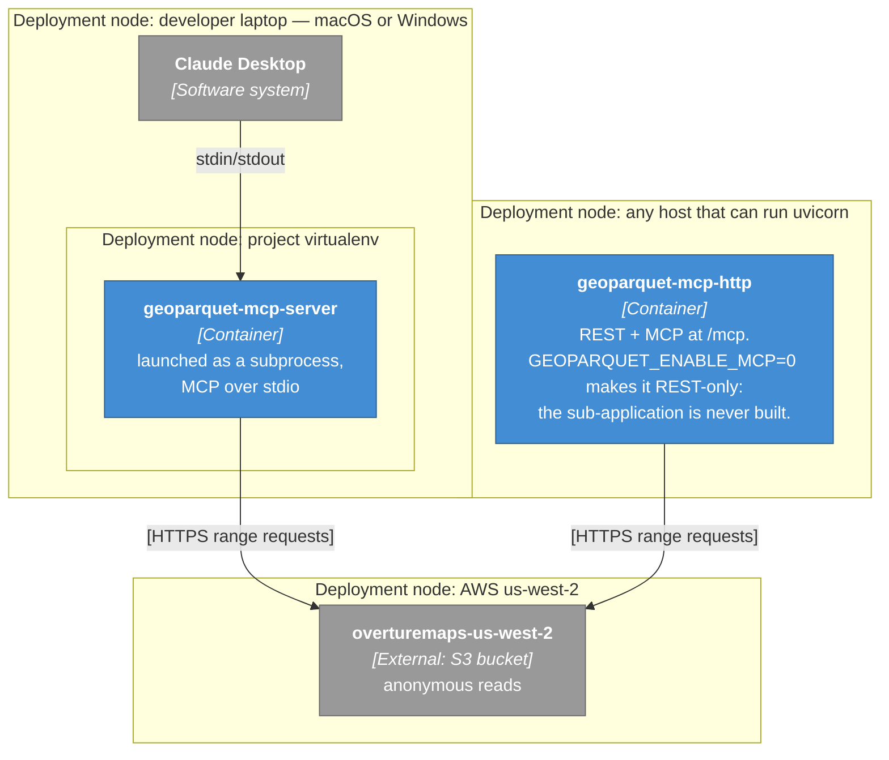

# Architecture, as a C4 model

Four diagrams at four zoom levels, following the [C4 model](https://c4model.com/): context, then
containers, then components, then code. Each level is the previous one with one box opened, so a
reader can stop at the depth their question needs.

The README already argues *why* this is built the way it is — MCP as an ASGI sub-application, tools
that implement nothing, a perimeter resolved once at startup. This document is the map that goes with
that argument: what the boxes are, which of them may talk to which, and which test fails when an
arrow appears that should not exist.

## How to read the diagrams

C4's own notation is a rectangle with a name, a technology, and a sentence of purpose, plus labelled
arrows that say what crosses the boundary. These use Mermaid flowcharts rather than Mermaid's
experimental `C4Context` syntax, so they render on GitHub as-is; the colours carry the C4 meaning:

| Colour | Element |
| --- | --- |
| dark blue | person — a human user |
| medium blue | software system in scope |
| grey | external system — someone else's, and not ours to change |
| lighter blue | container — a separately runnable process |
| pale blue | component — a grouping of code inside one container |

One caveat worth stating up front, because it makes level 2 look thin: this project is a single
process by design. There is no service mesh to draw, and the interesting structure lives at level 3.

---

## Level 1 — System context

Who uses this, and what it depends on.

Three things this level is meant to settle:

- **The data never enters the system.** The only arrow that carries bulk bytes points *at* the bucket,
  and what comes back is footers and the column chunks a filter could not rule out. There is no
  ingestion path, no scheduled sync, and no local copy to invalidate.
- **The two client kinds are peers.** An agent over MCP and a script over REST reach the same
  operations with the same arguments; neither is a wrapper around the other.
- **There is no authentication anywhere in the picture.** No identity provider, no credential store,
  no per-user perimeter. The bucket is public and the server is not. That is a stated limitation,
  not an omission from the diagram — see *What this is not* in the README.

---

## Level 2 — Containers

Zooming into `geoparquet-mcp`. A C4 container is something separately runnable; here, three
executables that are three shapes of the same code.

The dashed box is the honest part. `engine/` is not a container — it is never deployed on its own and
has no address — but drawing it at this level is the only way to show that the three containers are
alternatives rather than collaborators. **No arrow runs between the three processes.** You start one
of them; whichever you start links the same engine into its own address space, opens its own DuckDB
session, and reads the same bucket.

That is also where the architecture decision recorded in the README lands on the diagram. Option (b),
a separate MCP service proxying REST, would have made `stdio` and `http` two boxes with a network
arrow between them and two DuckDB sessions behind it. Option (a) keeps one box, one session, and one
warm footer cache — at the cost of one lifecycle for both protocols.

---

## Level 3 — Components

### 3a. Inside `geoparquet-mcp-http`

The container with the most structure: both façades, the adapter between them, and the engine as a
single box that the next diagram opens.

Read the arrows into `engine` and the shape of the claim falls out: `app.py` and `tools/` both point
at it, and neither points at the other. The REST routes are not calling the MCP tools, and the tools
are not calling the routes. Adding a third protocol adds a third arrow into the same box.

The `stdio` container is this diagram minus `app.py` and `conf` as a FastAPI concern: `server.main()`
resolves the configuration, installs the same dependencies, and runs the same registered handlers
over stdin/stdout. Two lines of deliberate duplication, chosen over a handler that silently falls
back to the default perimeter when nobody installed one.

### 3b. Inside `engine/`

The capability, with no protocol attached.

Two arrows carry the design.

**`operations.py` → `sources.py`** is the isolation boundary. No operation takes a path; it takes a
name and asks the scope. A scope can be narrowed and never widened, so a caller holding a restricted
one has no argument through which a wider perimeter could arrive.

**`operations.py` → `session.py`** is why the numbers exist. Every operation runs inside
`session.measure()`, and every result carries the `scan` block that window produced. Measurement is
not instrumentation bolted on afterwards — it is in the return type.

---

## Level 4 — Code

C4's optional level, and the one that ages fastest. This is the shape of the engine's own types, kept
to what a reader needs in order to follow a call.

`BoundingBox.predicate()` is the smallest box on this page and the one the whole project rests on. It
writes four independent comparisons on the `bbox` STRUCT members rather than an `ST_Intersects` over
the geometry, because Parquet keeps min/max statistics per column chunk: a plain comparison is
something the reader can evaluate against a footer, and a spatial function is an opaque call it must
materialise rows to run.

### Anchors

| Element | Where |
| --- | --- |
| Container wiring, both protocols | `src/geoparquet_mcp/app.py:78` |
| The double attachment at `/mcp` | `src/geoparquet_mcp/app.py:122` |
| MCP server construction and registration | `src/geoparquet_mcp/server.py:125` |
| Transport as a bare ASGI app | `src/geoparquet_mcp/server.py:139` |
| The lifespan a mount does not get | `src/geoparquet_mcp/server.py:178` |
| Perimeter resolved once | `src/geoparquet_mcp/dependencies.py:72` |
| What a handler is allowed to use | `src/geoparquet_mcp/dependencies.py:124` |
| Name to path, and nothing else | `src/geoparquet_mcp/engine/sources.py:338` |
| The one path-handling code path | `src/geoparquet_mcp/engine/sources.py:345` |
| Byte accounting per window | `src/geoparquet_mcp/engine/session.py:255` |
| Envelope first, exact second | `src/geoparquet_mcp/engine/operations.py:744` |
| SQL bounded by parsing | `src/geoparquet_mcp/engine/query.py:106` |

---

## Supplementary: one tool call, end to end

C4 calls this a dynamic diagram — the same components, ordered by time. This is
`geoparquet_filter_spatial` with a WKT polygon, which is the call that exercises every boundary at
once.

Steps 8 and 12 are the exactness contract: the envelope prunes the read and the exact geometry then
filters the survivors, so the answer is exact and the read stays proportional to the envelope rather
than to the dataset.

---

## Supplementary: deployment

Two deployments, and they are different process shapes rather than different configurations.

The laptop deployment is the constraint that decided the architecture. Claude Desktop starts a
subprocess and talks to its pipes: no orchestrator, no supervisor, nothing to keep a second process
in step. `docs/claude-desktop.md` is the configuration, and `./scripts/serve.sh config` prints it
with this clone's absolute path already in place; `./scripts/serve.sh stdio` and `./scripts/serve.sh
http` start the two containers above. Both entry points are driven over their own pipes by
`tests/test_cli.py`, because the step that makes a served process legitimate — resolving the
perimeter and installing it before serving — is a line whose absence no diagram and no AST walk can
see.

Environment variables are the only deployment-time knobs: `GEOPARQUET_SOURCES` narrows the perimeter,
`GEOPARQUET_RELEASE` pins a release, `GEOPARQUET_ENABLE_MCP` decides whether the MCP sub-application
exists at all, `GEOPARQUET_MCP_PATH` moves it, and `GEOPARQUET_MCP_ALLOWED_HOSTS` extends the SDK's
DNS-rebinding protection beyond localhost.

---

## What keeps these diagrams honest

A C4 diagram is a claim about which arrows exist, and a claim like that rots quietly. Most of the
ones above are enforced by a test rather than by review:

| The diagram says | The test that fails otherwise |
| --- | --- |
| Only `server.py` touches the protocol; the engine imports in a process with no `mcp` | `tests/test_layering.py` |
| Every arrow from `tools/` into `engine/` is one call, with nothing on either side of it | `tests/test_layering.py` — each handler's AST must be a single `return` |
| No SQL and no DuckDB anywhere under `tools/`, including in the prose a model reads | `tests/test_layering.py` |
| `sources.py` is the only name-to-path boundary, and it cannot be walked around | `tests/test_scope_isolation.py` — 18 attempts to escape the perimeter |
| The MCP surface a model sees is exactly what is drawn here | `tests/snapshots/mcp_surface.json` via `tests/test_protocol_surface.py` |
| The chained MCP lifespan is really chained, and `/mcp` answers without a redirect | `tests/test_app.py` |
| `cli.py` names only what the engine exports and never reaches through `tools/` | `tests/test_cli.py`, which walks its syntax tree |

When a diagram here and a test disagree, the test is right. Update the picture.
